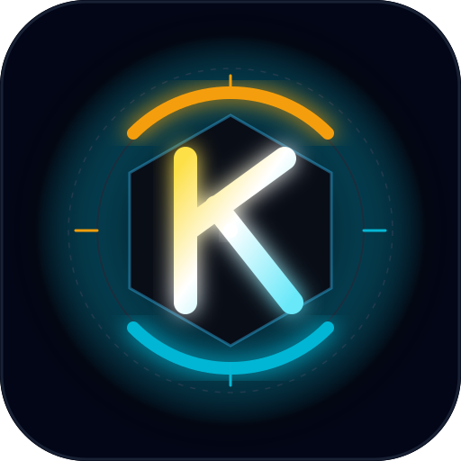

<p align="center">
  
</p>

<h1 align="center">KineticText 🎯🔥❄️</h1>

<p align="center">
  <strong>The Thermodynamic Typography Reactor — The editor that demands kinetic calories to keep your thoughts from crystallizing into oblivion.</strong>
</p>

<p align="center">
  
  
  
  
  
  
</p>

---

## Basic Details

### Team Name: Alkul

### Team Members
- Team Lead: Basudev Biju
- Member 2: Dominic Alosh

### Project Description
KineticText is an entropy-driven, thermodynamic writing terminal where typing is governed by the laws of thermodynamics. Your words possess thermal mass: typing injects heat (`+3.5°C` per keystroke), while blowing into your microphone feeds the acoustic bellows (`+10.0°C`). However, the reactor is cursed with continuous cryogenic decay (`-6.0°C` every 400ms).

Hesitate too long, and the core collapses to **Absolute Zero (0.0°C)**, causing your sentences to freeze into brittle rigid bodies that shatter and fall to the floor via 2D physics. Type in an unbridled panic, and the core breaches the **120.0°C** critical threshold, detonating the reactor with a procedural sonic boom, screenshake, incandescent plasma particles, and incinerating your text into ashes.

### The Problem (that doesn't exist)
Modern text editors suffer from complete thermodynamic indifference. Why should your editor sit comfortably at room temperature while you procrastinate? Why are writers permitted to stare blankly at a blinking cursor for hours with zero thermodynamic penalty? 

Thoughts generate friction, and language requires energy. Passive, inert text boxes cultivate hesitation and writer's block because there is no entropy at stake.

### The Solution (that nobody asked for)
KineticText turns writing into an active thermodynamic survival game. It replaces complacent word processing with an unstable reactor core:
1. **Constant Cryogenic Decay:** Inactivity causes temperatures to plummet at `-6.0°C/400ms`.
2. **Kinetic Keystroke Heating:** Every keystroke converts kinetic work into heat (`+3.5°C`). Backspace and Delete allow corrections without artificial heating.
3. **Acoustic Bellows (Web Audio Mic Input):** When suffering from writer's block, blow into your microphone. The audio frequency analyzer converts acoustic turbulence into thermal forge bellows (+10°C) to keep your core alive.
4. **Absolute Zero Matter.js Shatter:** If temperature hits `0.0°C`, the text canvas freezes and shatters into physical word blocks that bounce and collide off the viewport floor.
5. **Runaway Core Detonation (120°C Meltdown):** Exceeding `120.0°C` triggers an emergency detonation with canvas-rendered high-velocity debris, procedural audio explosion, and automatic thermal purging.

---

## The Thermal Spectrum

| State | Range | Visual Behavior | Telemetry Status | Special Mechanics |
| :--- | :--- | :--- | :--- | :--- |
| **💥 Meltdown (Detonation)** | `120.0°C` | Incandescent amber/crimson glitch | `💥 CRITICAL DETONATION // RUNAWAY` | Words incinerated, procedural Web Audio boom, full-screen flash, 190 particle blast, venting purge back to 65°C |
| **🔥 Hyperthermia (Overheating)** | `60.1°C – 119.9°C` | Amber glow + thermal micro-jitter | `CRITICAL HYPERTHERMIA` | Flame icon ignites, jitter typography, dynamic amber ambient lighting |
| **⚖️ Nominal (Equilibrium)** | `20.1°C – 60.0°C` | Crisp monospace slate | `THERMAL EQUILIBRIUM` | Clean writing state, minimal glow, stable decay rate |
| **❄️ Rapid Cooling** | `0.1°C – 20.0°C` | Cyan glow + frost vignette | `CRYO-FRACTURE IMMINENT` | Progressive radial frost blur up to 5px, snowflake indicator active |
| **🧊 Cryo-Fracture (Collapse)** | `0.0°C` | Textarea hidden, physics active | `CRITICAL CRYO-FRACTURE` | Matter.js 2D physics simulation shatters words into falling rigid blocks with hazard baseline |

---

## Technical Details

### Technologies & Components Used
- **Core Framework:** React 19, TypeScript
- **Bundler & Build Tool:** Vite 6 with `@tailwindcss/vite`
- **Styling & Aesthetics:** Tailwind CSS v4, Enterprise Glassmorphism design system, JetBrains Mono & Orbitron typography, CSS backdrop filters
- **Physics Simulation:** `matter-js` (rigid body physics, floor/wall restitution, gravity)
- **Audio Processing:** Native Web Audio API (`AudioContext`, `AnalyserNode` FFT microphone frequency analysis, procedural synthesizers for explosions)
- **Visual FX & Canvas:** 
  - Custom 2D Canvas explosion particle engine (shockwave ring, glowing sparks, velocity friction)
  - Custom Canvas Matter.js body renderer with cyan neon boundaries
  - Canvas-based `<LetterGlitch />` dynamic matrix ambient background
- **Icons:** `lucide-react` (Flame, Snowflake, RotateCcw, Mic, MicOff, Wind, Terminal, Zap, Activity)

---

## System Architecture

```
┌────────────────────────────────────────────────────────────────────────┐
│                        KINETICTEXT REACTOR HUD                         │
├────────────────────────────────────────────────────────────────────────┤
│ [Brand Logo] [Core Temp Gauge: 75.0°C] ─ [Status Pill] ─ [Bellows Mic] [Reignite] │
├────────────────────────────────────────────────────────────────────────┤
│                                                                        │
│  [ALERT BANNER (Shown during Detonation or 0K Cryo-Fracture)]         │
│                                                                        │
│  [MAIN TYPOGRAPHY ZONE]                                                │
│  Monospace dynamic editor · Inline phosphor block cursor               │
│  Line energy telemetry gutter (Joule ratings)                          │
│                                                                        │
│  [2D PHYSICS CANVAS (Matter.js word shatter on 0 Kelvin)]              │
│  [EXPLOSION CANVAS (190 particle high-velocity blast on 120°C)]         │
│  [LETTERGLITCH MATRIX BACKGROUND (Thermal-reactive canvas)]            │
│                                                                        │
├────────────────────────────────────────────────────────────────────────┤
│ [TELEMETRY FOOTER]                                                     │
│ [Decay: -6.0°C/400ms · Entropy Loss Tally]       [Keycap Shortcuts]    │
└────────────────────────────────────────────────────────────────────────┘
```

---

## Keyboard Controls & Matrix

| Shortcut | Action | Description |
| :--- | :--- | :--- |
| **Typing** | Inject Heat (`+3.5°C`) | Generates thermal energy to stave off cryogenic decay |
| **Backspace / Delete** | Delete Character | Safely erases text without artificially injecting heat |
| <kbd>Shift</kbd> + <kbd>F</kbd> | **Force Freeze** | Instantly drops reactor to 0.0°C to trigger Matter.js word shatter |
| <kbd>Shift</kbd> + <kbd>H</kbd> | **Core Detonation** | Overheats core to 120.0°C, triggering explosion FX and data purge |
| <kbd>Shift</kbd> + <kbd>R</kbd> | **Reignite Core** | Flushes reactor and restores baseline equilibrium (75.0°C) |
| <kbd>Shift</kbd> + <kbd>B</kbd> | **Boot Sequence** | Replays cinematic 3D camera zoom boot diagnostics |
| <kbd>Shift</kbd> + <kbd>M</kbd> | **Maximize Window** | Toggles full-bleed edge-to-edge window stretch mode |

---

## Implementation & Installation

### Prerequisites
- Node.js 18+ or 20+
- npm 9+

### Quick Start

```bash
# 1. Clone the repository
git clone https://github.com/blessen-george/KineticText.git
cd KineticText

# 2. Install dependencies
npm install

# 3. Launch local development server
npm run dev
```

Visit `http://localhost:5173` in your browser.

### Production Build

```bash
# Build production bundle with TypeScript check
npm run build

# Preview production build locally
npm run preview
```

---

## Project Documentation

### Key Engineering Features
1. **Non-Blocking Thermal Loop:** `requestAnimationFrame` and interval synchronization ensure smooth 60fps gauge interpolations and jitter micro-animations without lagging user input.
2. **Audio-Driven Forge Bellows:** Real-time RMS decibel detection with frequency smoothing filters out quiet room ambient noise and only triggers when genuine acoustic breath is blown across the microphone capsule.
3. **Physics Text Tokenizer:** Splits typed content into discrete typographic rigid bodies with accurate bounding dimensions, mass, bounce, and rotational friction.
4. **Cinematic 3D Boot Sequence:** CSS 3D perspective camera zoom transition with corner reticles, system checks, and seamless focal depth shift upon startup.
5. **Dominant Glassmorphic Window:** Deep `rgba(8, 12, 22, 0.94)` terminal glass chassis with 32px backdrop blur, isolating code text from the ambient background matrix.

---

Made with ❤️ at TinkerHub Useless Projects 


